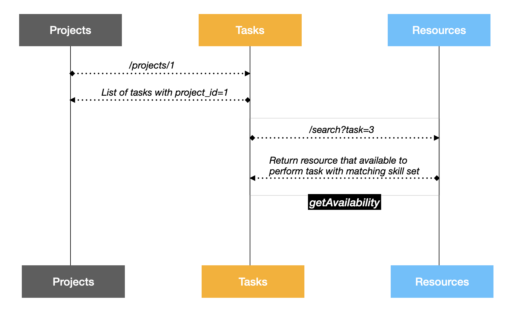
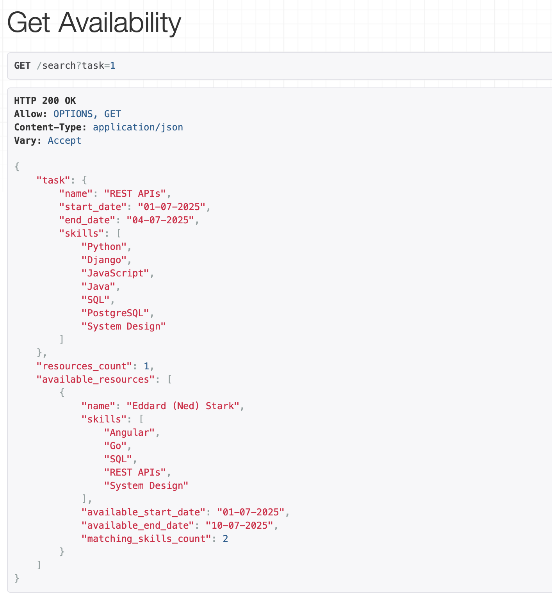
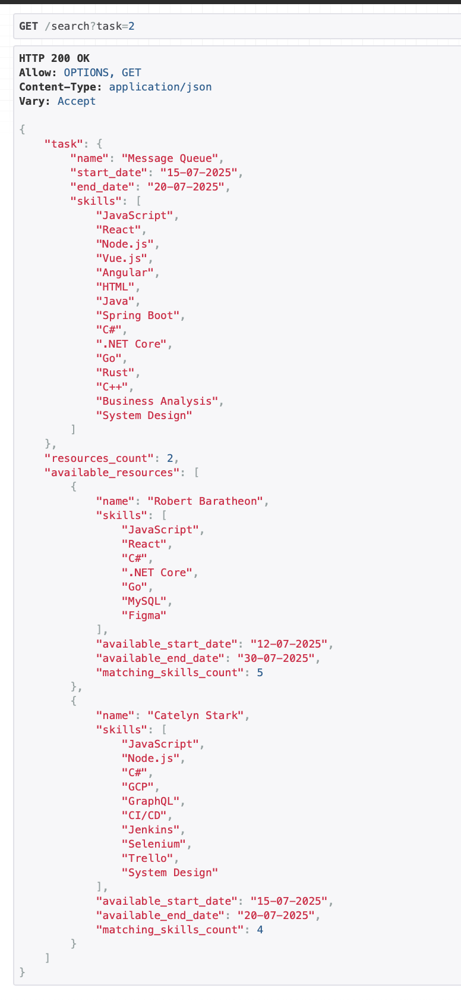
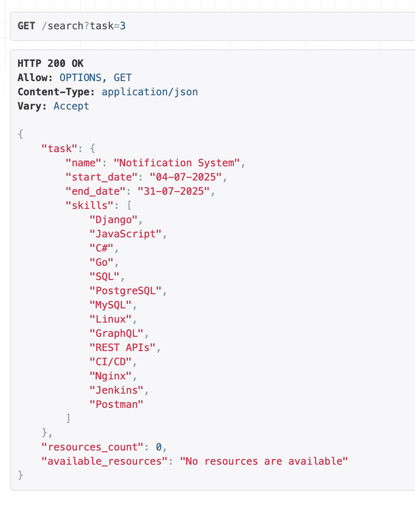

# Project Resource Scheduler

**Assignment:**
To understand the what application do and what solution it provide, check out the given docx link:
[View Full Documentation](project_resource_scheduler/Developer-Assessment 3-Resource Skill matching.docx)

### Folder Overview:

- **app folder** - main django app that contain application structure.
- **dump_data** - contain the sample data
- **prs** - it is engine for the django application
- **manage.py** - script for running django application
- **pipfile and pipfile.lock**- virtual environment file


## How to start application

1. **Create Pipenv env [Installation of pipenv in your respective OS](https://pipenv.pypa.io/en/latest/installation.html):**
```commandline
pipenv install

# To activate this project's virtualenv, run pipenv shell.
# Alternatively, run a command inside the virtualenv with pipenv run.
# Installing dependencies from Pipfile.lock (a2f100)...

pipenv shell

# Launching subshell in virtual environment...
```

2. **In the Activate Terminal, Install requirements:** 
```commandline
pipenv install django
pipenv install djangorestframework
pipenv install django-debug-toolbar
```

3. **Run migrations commands:**
```commandline
python manage.py makemigrations

python manage.py migrate
```

4. **Upload the Dummy data in Database**

```commandline
# To upload Skill Dataset
python manage.py loaddata dump_data/skill.json

# To upload Resources Dataset
python manage.py loaddata dump_data/resources.json

# To upload Project Dataset
python manage.py loaddata dump_data/projects.json

# To upload Tasks Dataset
python manage.py loaddata dump_data/tasks.json
```

## Sequence/Interaction Diagram

---



## Database Design

---

- Database is used in design "SQLite3"
- It contain Four Important Models:
  - **Skill Table**
    - [x] name (skill name)
  - **Resource**
    - [x] name (resource name)
    - [x] skills (skill list)
    - [x] available_start_date (resource available starting date)
    - [x] available_end_date (resource available ending date)
  - **Project**
    - [x] title (project title)
    - [x] description (project description)
  - **Tasks**
    - [x] name (Task title)
    - [x] skills (Task required skills)
    - [x] project (Task associate project)
    - [x] start date (Task starting date)
    - [x] end date (Task ending date)
- To view the SQL query run command
```commandline
    python manage.py sqlmigrate app 0001_initial
```

## Sample Data 

---

To view the sample data that used to build and develop the application, it is present in the folder **dump_data** in the main folder of project.


## Working Algorithm 

To get the available resources in the give time range of task with matching skill set.

In the url:
```url
http://127.0.0.1:8000/search?task=1
```

### getAvailability (task=1)



### getAvailability (task=2)


### getAvailability (task=3)
